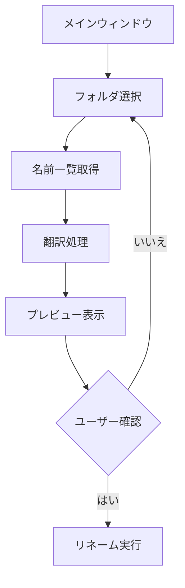

# フォルダ名翻訳アプリケーション設計書

## 1. 概要
フォルダ名と内部のファイル名を日本語に翻訳するGUIアプリケーション

## 2. 主要機能
- フォルダ選択（GUI）
- DeepL APIを使用した翻訳
- 翻訳結果のプレビュー表示
- 確認後の一括リネーム

## 3. 技術スタック
- 言語: Python 3.x
- GUIフレームワーク: tkinter
- 翻訳API: DeepL API
- 追加ライブラリ: 
  - `deepl`: DeepL API用クライアント
  - `pathlib`: パス操作

## 4. アプリケーション構造



## 5. クラス設計

```python
class MainWindow:
    def __init__(self):
        # メインウィンドウの初期化
        # GUIコンポーネントの配置

    def select_folder(self):
        # フォルダ選択ダイアログ表示

    def translate_and_preview(self):
        # 翻訳処理と結果表示

    def execute_rename(self):
        # 確認後のリネーム実行

class Translator:
    def __init__(self, api_key):
        # DeepL API初期化

    def translate(self, text):
        # テキスト翻訳処理

class FileProcessor:
    def __init__(self, root_path):
        # ファイル処理の初期化

    def get_items(self):
        # フォルダ/ファイル一覧取得

    def rename_items(self, name_mapping):
        # リネーム処理実行
```

## 6. ユーザーインターフェース

```
+------------------------+
|   フォルダ選択ボタン    |
+------------------------+
| 選択パス: [表示領域]    |
+------------------------+
| DeepL API Key: [入力欄] |
+------------------------+
|    プレビュー領域       |
| 元の名前 | 翻訳後の名前  |
| --------|------------|
|         |            |
|         |            |
+------------------------+
| [実行] [キャンセル]     |
+------------------------+
```

## 7. エラーハンドリング
- API認証エラー
- ファイルシステムエラー
- 無効な文字を含む翻訳結果の処理

## 8. 制限事項
- 一度に処理できるファイル数の制限
- ファイル名に使用できない文字の制限
- APIリクエスト制限への対応